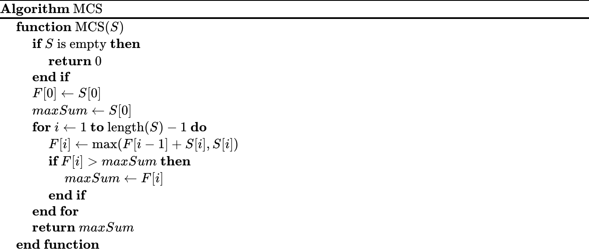

# DAA-Programming-Assignment

## 1. Formal Definition of the Problem

The Maximum Subarray Sum problem seeks to find the contiguous subarray (containing at least one number) which has the largest sum among all possible subarrays of a given integer array.

## 2. Recurrence Relation

Define $F[i]$ as the maximum sum of a subarray ending at index $i$. The recurrence relation can be expressed as:

$$F[i] = \max(F[i-1] + S[i], S[i])$$

where $S[i]$ is the value of the array at index $i$.

## 3. Definitions of Notations

- $S$: The input array containing integers.

- $F[i]$: The maximum sum of a subarray ending at position $i$ in array $S$.

- $\max$: A function returning the maximum of its arguments.

## 4. Pseudocode

The pseudocode for the Dynamic Programming solution of this problem is as follows:


<!--  -->
  
## 5. Time Cost Analysis

- **Initialization**: The initialization of `F[0]` and `maxSum` takes constant time, $O(1)$.

- **Loop**: The loop runs $n-1$ times if $n$ is the length of the array. Within each iteration, the operations (calculating $F[i]$ and updating `maxSum`) take constant time.

- **Overall**: The overall time complexity of the algorithm is $O(n)$, where $n$ is the number of elements in the input array, as each element is processed exactly once.

## 6. Bonus Part

1. This documentation was written in a Markdown file.
2. In my code, it can output all optimal solutions, both on the screen and to an output file.
3. The number of integers in the input is unknown. You can input an array of arbitrary size.
Here's a refined version of the guideline section of your documentation:

## 7. Guidelines about the Code

The implementation was performed using **standard C** and compiled with the GCC compiler.

### Compile

1. **Directory Structure**
To compile the code, ensure you are in the correct directory.  If you are in the correct path, you could see the following file tree structure:

```sh
.
├── Makefile
├── Pseudo.png
├── README.md
├── in
├── in_out
├── lib.c
├── lib.h
├── lib.o
├── mcs
├── mcs.c
└── mcs.o

1 directory, 11 files
```

2. **Compile the Code**:
   Once you have confirmed the directory structure, simply type `make` in the terminal:

```sh
make
```

   This command will compile the source files and should produce the following output:

```sh
gcc -c mcs.c
gcc -c lib.c
gcc mcs.o lib.o -o mcs
```

### Run

After compiling the code, you can execute the program by entering the following command in the terminal:

```sh
./mcs <InputFilename>
```

For example, to run the program with the input file named `in`, type:

```sh
./mcs in
```

This command will run the program using the data specified in the `in` file. Make sure that the input file is in the correct format and location as expected by the program.
